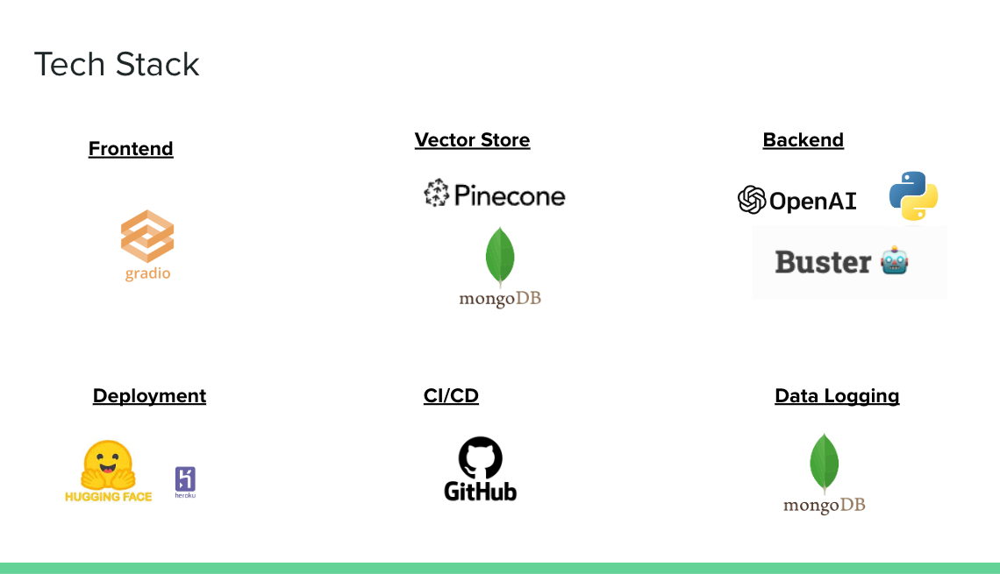

# SAI ️💬

SAI ️💬 is a Q&A search engine designed to provide relevant and high quality information about curated AI policy documents.

This project is a collaboration between the OECD and Mila.

It uses Retrieval-Augmented Generation (RAG) on AI policy documents curated by the OECD.


## Hosting
<!-- It deploys [buster](www.github.com/jerpint/buster) on AI policies collected by the OECD. -->

Links to current deployments of the app. We host the app on huggingface as well as on heroku.

| Service       | Dev URL                                                                                          | Prod URL                                                                                             |
|---------------|--------------------------------------------------------------------------------------------------|------------------------------------------------------------------------------------------------------|
| Heroku        | [Dev](https://ai4h-databank-dev.herokuapp.com/)                                                 | [Prod](https://ai4h-databank-prod.herokuapp.com/)                                                   |
| Huggingface   | [Dev (private)](https://huggingface.co/spaces/mila-quebec/SAI-dev)                              | [Prod (public)](https://huggingface.co/spaces/mila-quebec/SAI)                                     |

Note that the Dev space on huggingface is private and you need to be a member of the org. to view it.
Note that on Heroku, a username and password are required to sign in:

```
username: databank-$USERNAME
password: MilaDatabank!!123
```

Where `$USERNAME` can be any username, ideally used to identify who is using the app (e.g. `databank-jeremy`)


## Tech Stack

Here is an overview of our tech stack:




## How to run locally

### Install the dependencies

It is recommended to work in a virtual environment (e.g. conda) when running locally.
Simply clone the repo and install the dependencies.

Or, in a terminal:
```sh
git clone git@github.com:mila-iqia/ai4h_databank.git
cd ai4h_databank

# install the package locally
pip install -e .
```


Note that SAI requires python>=3.10


### Environment variables

The app relies on configured environment variables for authentication to openai, mongodb, and pinecone as well as some server information:
You will first need to configure the environment variables:

```sh
export OPENAI_ORGANIZATION=...
export OPENAI_API_KEY=sk-...
export MONGO_URI=...
export PINECONE_API_KEY=...
export INSTANCE_TYPE= ... # One of [dev, prod, local]. Determines where to log all app interactions.
export INSTANCE_NAME= ... # An identifier to know which platform we are logging from (e.g. huggingface-server-1)
```

To get access to the secrets, contact the app maintainers.

Note that if any of the environment variables are missing, the app might not launch.

### Running the app

There are currently 2 ways of running the app, via gradio or as a mounted app.
When the app is mounted, it allows for multiple endpoints to be exposed.

#### Gradio

Go to the folder of the app and simply run the app from there:

```sh
cd src/buster
gradio gradio_app.py
```

#### Mounted app

simply run

```sh
cd src/
python app.py
```

Note that the mounted app launches with authentication enabled. To set usernames and passwords, simply:

```sh
export AI4H_APP_USERNAME=...
export AI4H_APP_PASSWORD=...
```

Note that the auth. uses gradio's built-in authentication and is currently set such that any username starting with `AI4H_APP_USERNAME` will be considered valid. See `app_utils.py:check_auth`.

### App Deployment

The simplest way to deploy the apps is via the CI/CD pipelines. We have automated deployment using github actions.

Every time a new PR is opened, the CI/CD runs and deploys the apps on both dev instances once all checks pass.
Checks include unit tests and linting (black and isort).

Once a PR gets merged to `main`, the app is then deployed to the `prod` instances.

Currently, the CI/CD pipeline deploys the mounted app on heroku and the buster gradio app on huggingface.

## Configuring the App

The app uses [buster 🤖](www.github.com/jerpint/buster) at its core.

Buster uses a config file, `./src/cfg/py`, where all of the settings including models used, prompts, number of sources retrieved, etc. can be tuned.

Refer to Buster documentation to learn more about customizing and adding features.

The frontend is all powered by Gradio's interface.

## Chunk Management

We built our own chunk management tool, which combines both pinecone and mongoDB. Pinecone is used exclusively as a vector store, and all metadata associated to vectors are indexed in mongodb.

## Logging and Feedback

The app supports feedback and logging, which is all stored on mongodb.

### Feedback and interaction logging

All feedback forms are uploaded to mongodb, to their relevant database collections set in `cfg.py`.

The `INSTANCE_TYPE` env. variable determines which database to log to (prod, dev, or local).

Interactions (all submitted questions+responses) are logged to their own separate collection.

Finally, flagged submissions are also stored in their own collection.

### System logs

On huggingface, system logs are only kept on the the ephemeral built-in logging. This logging gets reset every time a new build is triggered.

On heroku, we use papertrail to capture and store system logs.

## How to backup a database

```sh
mongodump --archive="backup-ai4h-databank-prod-2023-09-29" --db="ai4h-databank-prod" --uri="mongodb+srv://ai4h-databank-dev.m0zt2w2.mongodb.net/" --username miladatabank
mongorestore --archive="backup-ai4h-databank-prod-2023-09-29" --nsFrom='ai4h-databank-prod.*' --nsTo='backup-ai4h-databank-prod-2023-09-29.*' --uri="mongodb+srv://ai4h-databank-dev.m0zt2w2.mongodb.net/" --username miladatabank
```